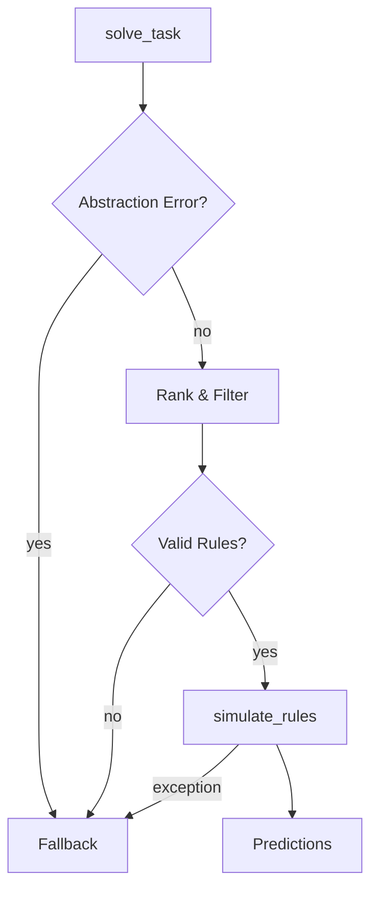

# Execution Flow Overview

The Meta-Symbolic ARC Solver infers a small symbolic program for each ARC task. Rules are represented as `SymbolicRule` objects or chains in `CompositeRule`. The solver emphasises deterministic reasoning so every transformation can be traced step by step.

```
solve_task() → abstraction → scoring → validation → simulation → predictions
```

## 1. Input Loading
- `solve_task` from [`executor/full_pipeline.py`](arc_solver/src/executor/full_pipeline.py) parses the JSON task to obtain `train_pairs` and `test_inputs` as `Grid` objects.
- Logging is set up via `get_logger` when `debug=True`.

## 2. Abstraction
1. For each `(input, output)` pair:
   - `abstract()` in [`abstractions/abstractor.py`](arc_solver/src/abstractions/abstractor.py) extracts candidate rules.
   - `generalize_rules()` and `remove_duplicate_rules()` from [`abstractions/rule_generator.py`](arc_solver/src/abstractions/rule_generator.py) refine the rule list.
   - `select_independent_rules()` in [`executor/dependency.py`](arc_solver/src/executor/dependency.py) filters conflicting rules.
2. Composite rules from [`symbolic/composite_rules.py`](arc_solver/src/symbolic/composite_rules.py) are handled via `CompositeRule.as_symbolic_proxy()` so dependency sorting can treat them like simple rules.

## 3. Scoring
- Candidate sets are ranked using `probabilistic_rank_rule_sets()` from [`rank_rule_sets.py`](arc_solver/src/rank_rule_sets.py).
- Each rule is scored by `score_rule()` in [`executor/scoring.py`](arc_solver/src/executor/scoring.py) which combines pixel similarity, zone overlap and a complexity penalty derived from `rule_cost()`.
- Visual refinement may rerank candidates via `rerank_by_visual_score()`.

## 4. Filtering & Validation
- Duplicate rules are removed by hashing their DSL forms.
- `validate_color_dependencies()` in [`executor/simulator.py`](arc_solver/src/executor/simulator.py) checks that required source colours remain present before applying each rule.
- Only well formed rules (``is_well_formed``) proceed to simulation.

## 5. Rule Dependency Sorting
- Independent rules are selected again using `select_independent_rules` before final simulation. Dependency graphs avoid conflicting writes.

## 6. Simulation
- `simulate_rules()` from [`executor/simulator.py`](arc_solver/src/executor/simulator.py) applies each rule sequentially.
- Conflict resolution relies on `mark_conflict()` with the policy defined by `CONFLICT_POLICY`.
- Composite programs are expanded via `simulate_composite_rule()`.
- Fallbacks to `fallback_predict` are triggered only after all symbolic candidates – including those rejected by validation – have been simulated.  If any rule scores sufficiently high the fallback is bypassed.

## 7. Output Formatting
- Predictions for each test grid are returned by `solve_task` and written to `submission.json` by higher level scripts.

### Example Flow for Task `00576224`
1. `solve_task` loads the training grid and extracts rules.
2. `validate_color_dependencies` simulates each composite and checks colour sufficiency only at the final step. All candidates still fail to score above the threshold.
3. Before falling back the solver now checks for any candidate rule whose raw similarity is `1.0`. Such rules are executed regardless of cost penalties. If none succeed the fallback predictor is invoked and the event is logged with `reason: high_cost_valid_rule`.
4. The solver then invokes the fallback predictor. A dataset-ranked transformation (rotation or mirror) is applied before padding with the dominant colour. The result is recorded in `submission.json`:
   ```json
   {"00576224": [{"attempt_1": [[0,0,...]] ... }]
   ```
   This behaviour is noted in the architecture file as a divergent prediction case.

## Failure Path Diagram

Exceptions during abstraction or simulation, low visual score, or invalid rules all route to the fallback predictor.

When a rule is rejected or fails during simulation, a JSON entry is appended to `logs/failure_log.jsonl` capturing the `rule_id`, `rejection_stage`, `failed_step_index`, the `intermediate_grids` snapshot and the present `color_lineage`.  If scoring debug output is enabled the record also includes a `score_trace` object detailing similarity, penalties and the operations used.
```json
{"task_id": "00576224", "rule_id": "REPEAT -> REPLACE", "rejection_stage": "validation", "failed_step_index": 0, "reason": "missing_color", "color_lineage": [[1,2]], "intermediate_grids": [[[1,2],[2,1]]]}
```

## Operator Simulation

`_apply_functional` handles symbolic operators such as `mirror_tile`, `draw_line`,
`pattern_fill`, `zone_remap`, `dilate_zone`, `erode_zone` and `rotate_about_point`.
Each branch verifies required parameters before invoking the corresponding helper
from `arc_solver.src.symbolic`. If a helper fails, the original grid is returned
so simulation continues safely. Currently only 90° rotations are supported and
lines are drawn 4‑connected with a thickness of one cell.

